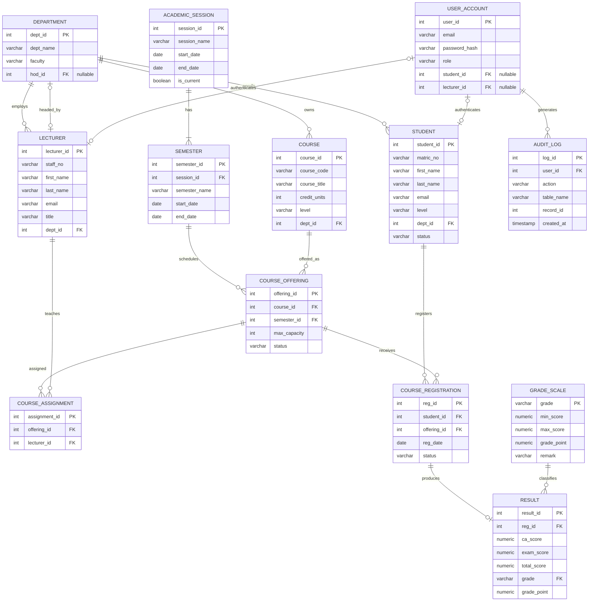

# ER Diagram

This is the current source-of-truth ERD direction for UniReg.

## Important Design Notes

- `RESULT` links to `COURSE_REGISTRATION`, not directly to `STUDENT` and `COURSE`. This enforces that a result can only exist for a course the student registered.
- `ACADEMIC_SESSION` stores academic years such as `2025/2026`; `SEMESTER` stores periods inside a session.
- `COURSE_OFFERING` is the actual registerable unit: one course in one semester.
- `USER_ACCOUNT` avoids a polymorphic `reference_id`. Student and lecturer links are nullable foreign keys so SQL can enforce valid references.
- `GRADE_SCALE` stores grade thresholds and grade points, allowing GPA logic to be data-driven.
- `DEPARTMENT.hod_id` points to `LECTURER`. It should be nullable during setup, then updated after lecturers exist.
- `AUDIT_LOG` can be populated by triggers when sensitive records such as results are inserted or updated.

